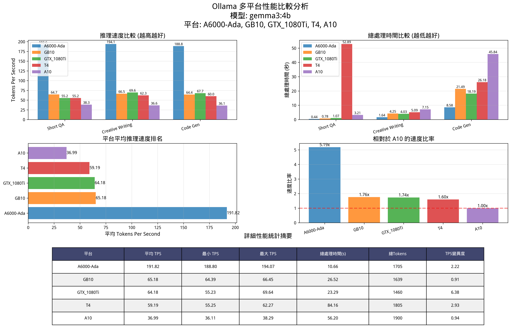
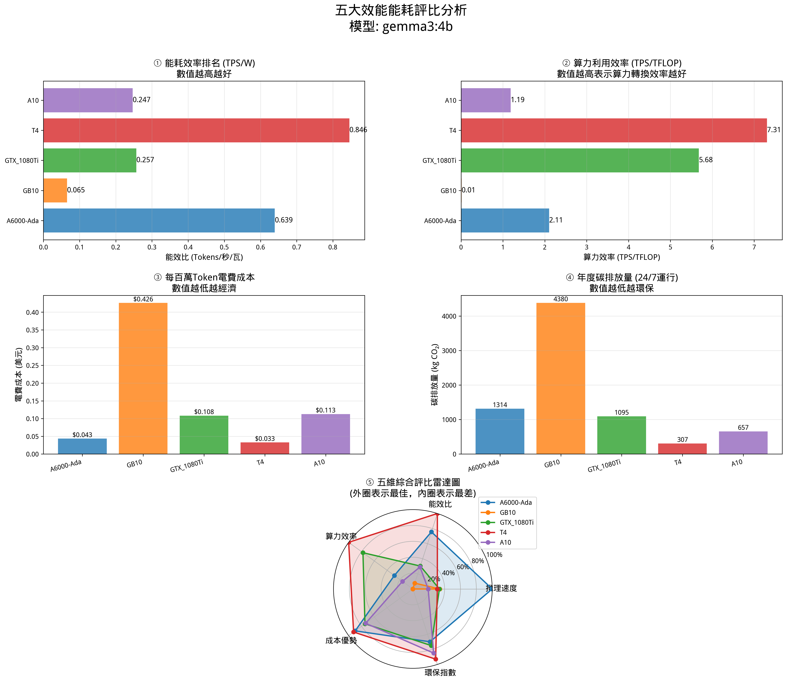
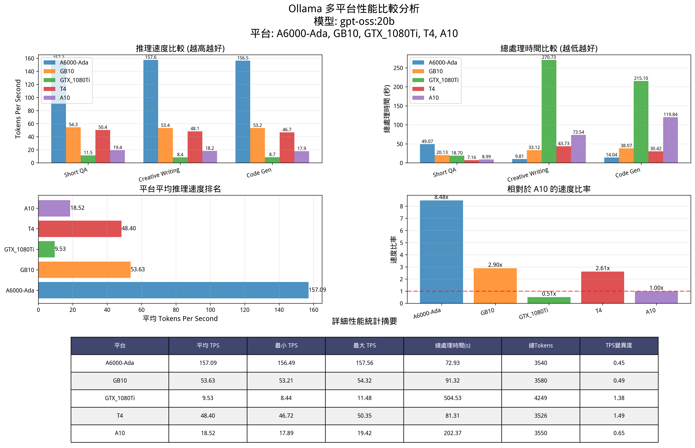
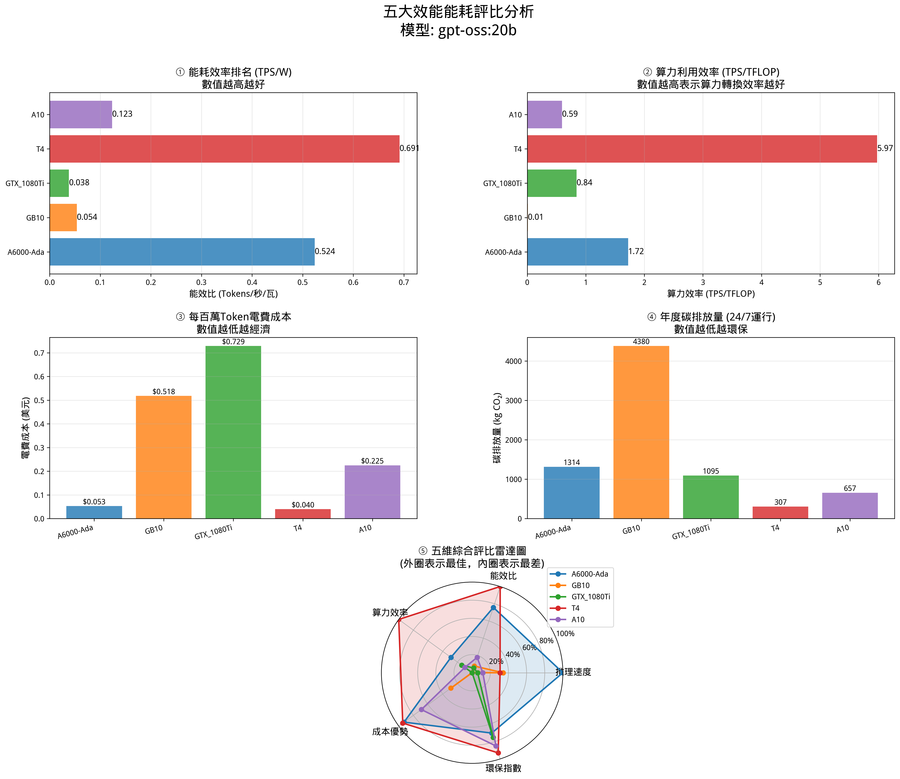

# FY115 LLM Capability Test Case

## 專案簡介

本專案為 **FY115 大型語言模型 (LLM) 推理能力測試**，針對多款 NVIDIA GPU 硬體平台進行 Ollama 模型推理性能基準測試與分析。

測試涵蓋 **5 個硬體平台**、**2 個模型**，提供完整的性能比較、能效分析與成本評估。

---

## 測試平台

| 平台 | GPU | TDP (W) | FP32 算力 (TFLOPS) |
|------|-----|---------|---------------------|
| A6000-Ada | NVIDIA RTX A6000 Ada | 300W | 91.1 |
| GB10 | NVIDIA GB10 | 1000W | 5000 |
| GTX_1080Ti | NVIDIA GTX 1080 Ti | 250W | 11.3 |
| T4 | NVIDIA Tesla T4 | 70W | 8.1 |
| A10 | NVIDIA A10 | 150W | 31.2 |

## 測試模型

| 模型 | 參數量 | 用途 |
|------|--------|------|
| `gemma3:4b` | 4B | 輕量級推理基準測試 |
| `gpt-oss:20b` | 20B | 大參數量推理性能驗證 |

## 測試案例

每個模型在所有平台上執行以下三個測試場景：

1. **Short QA** - 簡短問答 (低複雜度)
2. **Creative Writing** - 創意寫作 (中複雜度)
3. **Code Gen** - 程式碼生成 (高複雜度)

---

## 目錄結構

```
.
├── README.md                    # 本文件
├── scripts/                     # 測試與分析腳本
│   ├── ollama_test.py           # Ollama 推理基準測試腳本
│   ├── analyze_performance.py   # 雙平台性能分析 (v1)
│   └── analyze_performance_v2.py # 多平台性能分析 (v2，支援能效評比)
├── data/                        # 測試原始數據 (JSON)
│   ├── gemma3_4b/               # gemma3:4b 模型測試數據
│   │   ├── A6000-Ada-ollama_performance_memory.json
│   │   ├── GB10-ollama_performance_memory.json
│   │   ├── 1080Ti-ollama_performance_memory.json
│   │   ├── T4-ollama_performance_memory.json
│   │   └── A10-ollama_performance_memory.json
│   └── gpt_oss_20b/             # gpt-oss:20b 模型測試數據
│       ├── A6000-Ada-gptoss20b-ollama_performance_memory.json
│       ├── GB10_gptoss20b-ollama_performance_memory.json
│       ├── 1080Ti-gptoss20b-ollama_performance_memory.json
│       ├── T4-gpt-oss20b-ollama_performance_memory.json
│       └── A10-gptoss20b-ollama_performance_memory.json
├── reports/                     # 分析報告
│   ├── gemma3_4b_performance_report.md
│   ├── gpt_oss_20b_performance_report.md
│   ├── performance_analysis_report.md
│   ├── 效能能耗評比說明.md
│   └── 分析摘要.md
└── images/                      # 圖表與視覺化結果
    ├── gemma3_4b/               # gemma3:4b 分析圖表
    │   ├── multi_platform_performance_comparison.png
    │   ├── multi_platform_performance_comparison5.png
    │   └── efficiency_power_comparison.png
    ├── gpt_oss_20b/             # gpt-oss:20b 分析圖表
    │   ├── multi_platform_performance_comparison.png
    │   └── efficiency_power_comparison.png
    └── overview/                # 綜合比較圖表
        ├── performance_comparison_report.png
        ├── multi_platform_performance_comparison2.png
        └── multi_platform_performance_comparison3.png
```

---

## 關鍵測試結果

### gemma3:4b 模型

| 排名 | 平台 | 平均 TPS | 相對速度 |
|------|------|----------|----------|
| 🥇 | A6000-Ada | 191.82 | 1.00x |
| 🥈 | GB10 | 65.18 | 0.34x |
| 🥉 | GTX_1080Ti | 64.18 | 0.33x |
| 4 | T4 | 59.19 | 0.31x |
| 5 | A10 | 36.99 | 0.19x |

### gpt-oss:20b 模型

| 排名 | 平台 | 平均 TPS | 相對速度 |
|------|------|----------|----------|
| 🥇 | A6000-Ada | 157.09 | 1.00x |
| 🥈 | GB10 | 53.63 | 0.34x |
| 🥉 | T4 | 48.40 | 0.31x |
| 4 | A10 | 18.52 | 0.12x |
| 5 | GTX_1080Ti | 9.53 | 0.06x |

### 能效評比 (gemma3:4b)

| 指標 | 最佳平台 | 數值 |
|------|----------|------|
| 能效比 (TPS/W) | T4 | 0.846 |
| 每百萬Token成本 | T4 | $0.033 |
| 年碳排放量 | T4 | 307 kg CO₂ |
| 絕對性能 | A6000-Ada | 191.82 TPS |

---

## 環境需求

### Python 環境

```bash
conda activate chatbot
```

### 必要套件

```bash
pip install ollama matplotlib numpy
```

### Ollama 服務

需要在測試機器上安裝並運行 [Ollama](https://ollama.ai/)：

```bash
# 安裝模型
ollama pull gemma3:4b
ollama pull gpt-oss:20b
```

---

## 使用方法

### 1. 執行基準測試

修改 `scripts/ollama_test.py` 中的平台名稱和輸出路徑，然後執行：

```bash
python scripts/ollama_test.py
```

### 2. 多平台性能分析

分析所有 JSON 測試數據並生成圖表與報告：

```bash
# 分析 gemma3:4b 數據
cd data/gemma3_4b
python ../../scripts/analyze_performance_v2.py

# 分析 gpt-oss:20b 數據
cd data/gpt_oss_20b
python ../../scripts/analyze_performance_v2.py
```

### 3. 指定特定檔案分析

```bash
python scripts/analyze_performance_v2.py --files data/gemma3_4b/A6000-Ada-ollama_performance_memory.json data/gemma3_4b/GB10-ollama_performance_memory.json
```

---

## 分析圖表預覽

### gemma3:4b 多平台性能比較


### gemma3:4b 能效評比


### gpt-oss:20b 多平台性能比較


### gpt-oss:20b 能效評比


---

## JSON 數據格式

測試數據以 JSON 格式儲存，結構如下：

```json
[
    {
        "timestamp": "2026-01-02T10:28:40.490124",
        "platform": "A6000-Ada",
        "model": "gemma3:4b",
        "test_case": "Short QA",
        "metrics": {
            "total_duration_sec": 0.440481986,
            "load_duration_sec": 0.228770447,
            "tokens_per_second": 192.58,
            "eval_count": 35,
            "prompt_eval_count": 19
        }
    }
]
```

---

## 授權

本專案僅供內部研究與測試使用。

---

## 聯絡

- **維護者**: Rachel Liu
- **專案**: FY115 LLM Capability Test Case
- **日期**: 2026年1月
